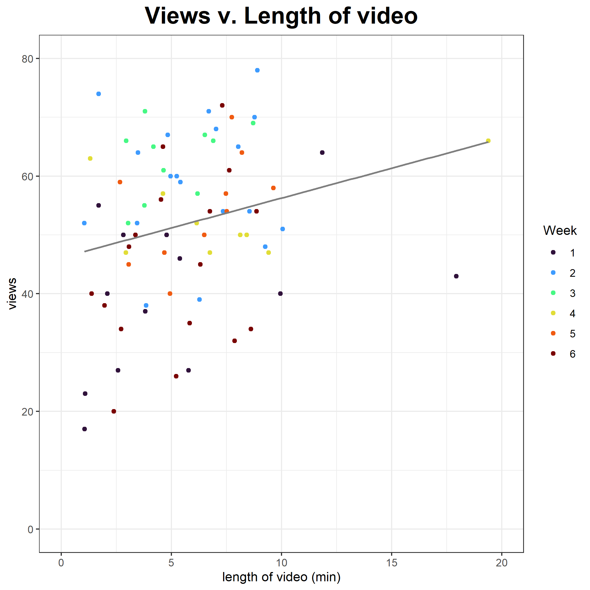
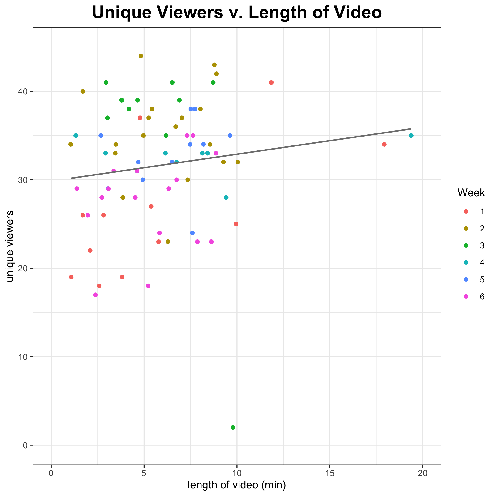

```{r, set-chunk-opts, echo = FALSE, eval = TRUE}
library(knitr)
opts_chunk$set(
  echo = FALSE, warning = FALSE, message = FALSE
)
```


```{r, load-data}
here::i_am("Report.Rmd")
data <- readRDS(
  file = here::here("Output/data_clean.rds")
)
```


# Descriptive Analysis

## Tabular analysis

Characteristics of the `r nrow(data)` videos from the course engagement database are displayed
in the table below.

```{r, table1, warning=FALSE}
table_one <- readRDS(
  file = here::here("Output/table_one.rds")
)
table_one
```

Zhanxu's ANOVA table
```{r}
ANOVA <- readRDS(
  file = here::here("Output/summary_anova.rds")
)
ANOVA
```
From the ANOVA table, we can conclude that there is no statistically significantly difference between video length within 6 weeks.

Grace's ScatterPlots
```{r}
views_scatter<-

unq_viewers_scatter<-

views_scatter

unq_viewers_scatter
```


